# 🧩 Лабораторная работа №1
**Тема:** Классическая модель разграничения доступа Unix и PAM  
**Дисциплина:** Безопасность операционных систем

---

## 🎯 Цель работы
Рассмотреть дискреционную модель разграничения доступа в Unix‑подобных ОС, особенности исполнения привилегированных программ и механизмы аутентификации (PAM).

---

## 🔹 Задание 1. Импорт ВМ и доступ по SSH

**Требование:**  
Импортировать виртуальную машину из предоставленного образа `OSSec_lab1.ova`, включить сетевой мост и обеспечить возможность подключения по SSH.

---
### Ход выполнения

1. Открыто VirtualBox → *Файл → Импорт конфигурации…*  
   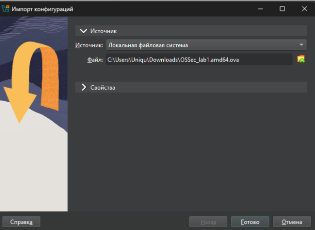

2. Выбран образ **OSSec_lab1.ova**. После импорта выполнена проверка параметров оборудования.

3. В настройках сети установлен режим **Сетевой мост (Bridged Adapter)**.
    - Интерфейс: *Realtek USB FE Family Controller*
    - Тип адаптера: *Intel PRO/1000 MT Desktop (82540EM)*
    - Неразрешённый режим: *Запрещать*  
      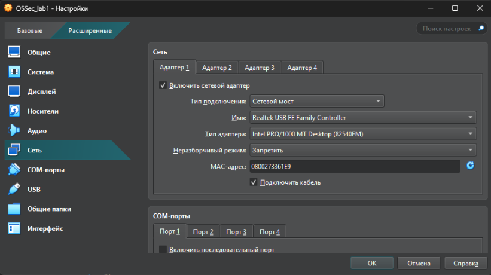

4. Виртуальная машина запущена, получен IP‑адрес с помощью `ip a`.
5. Подключение по SSH выполнено с хостовой машины:
   ```
   ssh user@192.168.X.X
   ```
   После ввода пароля доступ к системе получен успешно.

**Результат:**  
Виртуальная машина импортирована, корректно функционирует в локальной сети и доступна по протоколу SSH.

**Вывод:**  
Среда успешно подготовлена для дальнейших лабораторных экспериментов. 


---
## 🔹 Задание 2. Изменение паролей пользователей и анализ парольной политики

**Требование:**  
Изменить пароли пользователей `root` и `user`. Определить параметры парольной политики, установленные в системе: минимальная длина, сложность, допустимые символы и механизм реализации.

---

### Ход выполнения

1. Для сброса пароля выполнена загрузка системы в режиме **Single User / Recovery Mode**.  
   В окне загрузчика GRUB выбрана опция редактирования строки загрузки.

   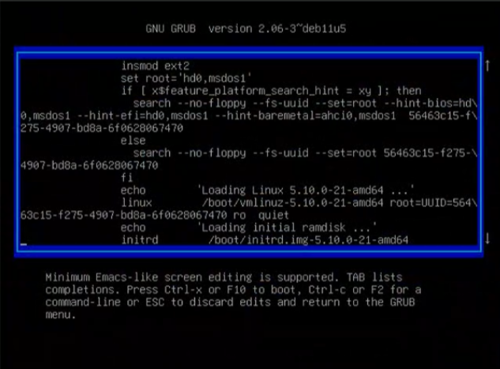

2. В конец строки, начинающейся с `linux`, добавлены параметры:
   ```
   rw init=/bin/bash
   ```
   Это позволяет запустить систему с доступом к оболочке root без проверки пароля.

   

3. После загрузки система предоставила доступ к shell от имени root.  
   С помощью команды `passwd` был изменён пароль суперпользователя:

   ```
   passwd
   ```
   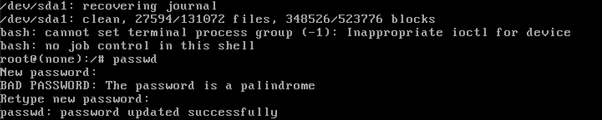

4. Аналогично изменён пароль пользователя `user`:
   ```
   passwd user
   ```
   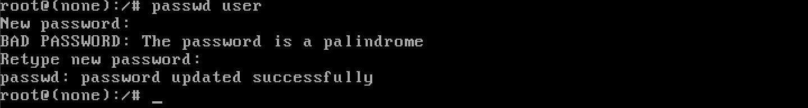

---

### Анализ парольной политики

При изменении пароля система выводила предупреждение:
> **BAD PASSWORD: The password is a palindrome**

Это указывает на наличие встроенного модуля проверки качества паролей — **`pam_pwquality.so`**, входящего в состав PAM (Pluggable Authentication Modules).
Его конфигурация задаётся в файле `/etc/security/pwquality.conf`. На момент анализа были установлены следующие параметры:


- Минимальная длина пароля:
  ```
  minlen = 8
  ```
  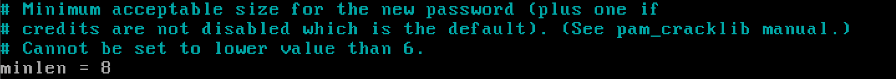

- Минимум **2 цифры**:
  ```
  dcredit = -2
  ```
  

- Минимум **2 заглавные буквы**:
  ```
  ucredit = -2
  ```
  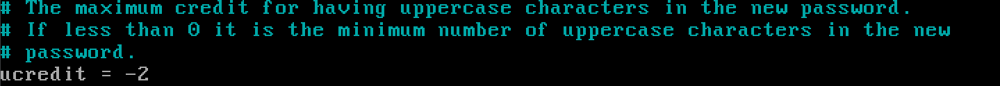

- Минимум **2 спецсимвола** (не буквы/цифры):
  ```
  ocredit = -2
  ```
  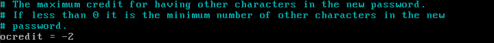

- Не более одного повторяющегося символа подряд:
  ```
  maxrepeat = 1
  ```
  

- 5 попыток на ввод пароля:
  ```
  retry = 5
  ```
  

---

### Вывод

Парольная политика в системе реализована через `pam_pwquality.so` и настроена достаточно жёстко.  
Она требует минимум 8 символов, по 2 символа каждого класса (цифры, заглавные, спецсимволы), ограничивает повторы и допускает 5 попыток ввода.  
Такой подход обеспечивает устойчивость к подбору паролей и базовую защиту от слабых комбинаций.

---

## 🔹 Задание 3. Блокировка входа от имени root

---

## 🧪 Цель задания

Выяснить, какие механизмы препятствуют входу в систему от имени суперпользователя `root`, и отключить соответствующую блокировку.

---

## 🔍 Анализ

1. При попытке входа как `root` через tty была выполнена проверка доступа PAM-модулем `pam_time.so`.  
   Открыт для редактирования файл:
   ```
   nano /etc/security/time.conf
   ```
   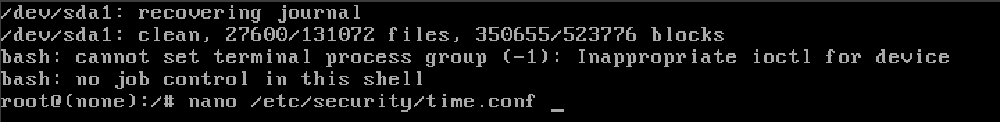

2. В конце файла обнаружено следующее правило:
   ```
   *;*;root;!A10000-2400
   ```

   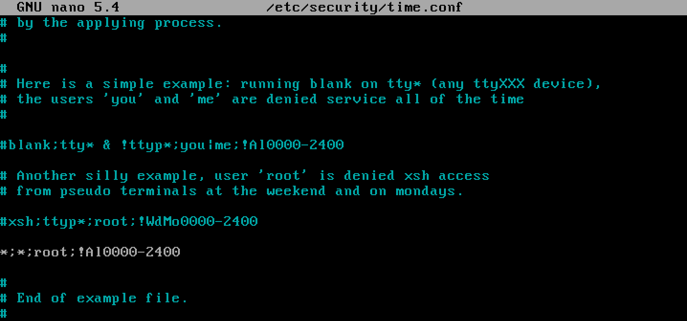

   Это означает запрет входа пользователю `root` по **всем службам**, **на всех терминалах**, **всегда** — с **00:00 до 24:00** ежедневно.


3. Это правило наследуется из PAM-конфигурации:
   ```
   /etc/pam.d/common-auth
   ```
   где явно подключён модуль `pam_time.so`:
   ```
   account requisite pam_time.so
   ```

   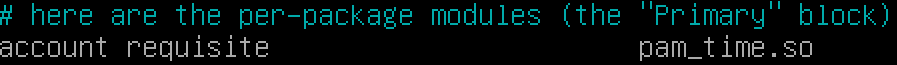

---

## 🛠 Устранение блокировки

Чтобы разрешить вход для `root`, закомментировано соответствующее правило из файла `/etc/security/time.conf`:


---

## ✅ Проверка

После комментирования строки `*;*;root;!A10000-2400` выполнен вход от имени root:

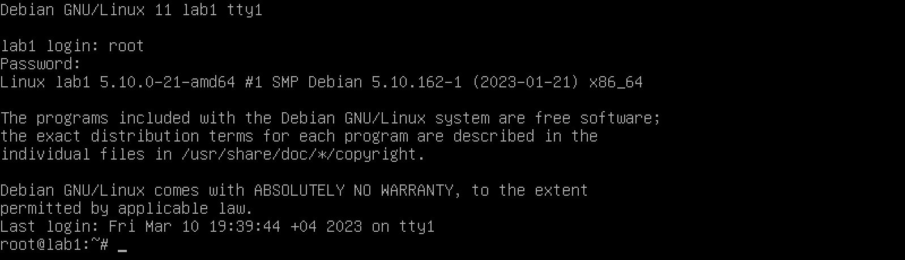

---
## 🧾 Вывод

Вход суперпользователя `root` был заблокирован модулем `pam_time.so` через правило в `/etc/security/time.conf`, запрещающее логин в определённое время.  
Комментирования этого правила восстановило возможность авторизации.

---

## 🔹 Задание 4. Блокировка входа в систему от имени пользователя `user`

---

## 🧪 Цель задания

Определить, какие механизмы препятствуют входу пользователя `user` в систему, и отключить соответствующую блокировку.

---

## 🔍 Анализ ситуации

1. Перейдём в директорию PAM-конфигурации:
   ```
   nano /etc/pam.d
   ```
   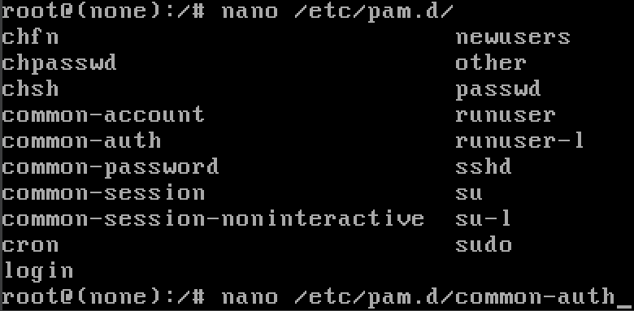

2. Открыт файл `/etc/pam.d/common-auth`:
   ```
   nano /etc/pam.d/common-auth
   ```
   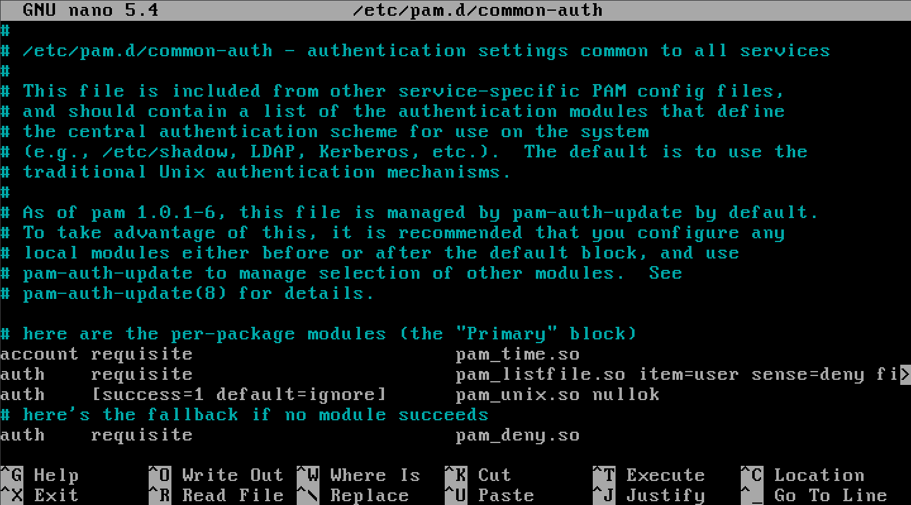

3. В конфигурации обнаружен модуль `pam_listfile.so`, запрещающий доступ пользователям из файла:
   ```
   auth requisite pam_listfile.so item=user sense=deny file=/root/bannedusers onerr=fail
   ```
   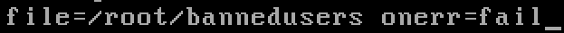

4. Открыт указанный файл `bannedusers`:
   ```
   nano /root/bannedusers
   ```
   

5. Видим, что в списке находится имя `user`:
   

---

## 🛠 Решение

Удалим имя `user` из файла `/root/bannedusers`:

1. Очистка файла:
   ```
   nano /root/bannedusers
   ```
   

2. Сохраняем изменения и повторно пробуем войти в систему от имени пользователя `user` через `ssh` или `login`.

3. Успешный вход подтверждает снятие блокировки:
   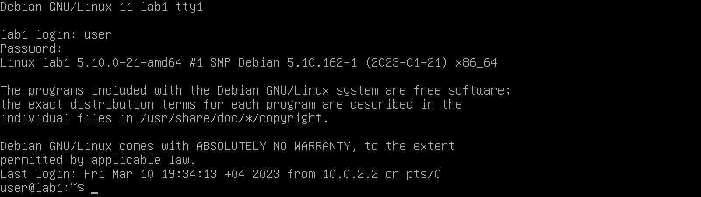

---

## 🧾 Дополнение: Поведение PAM

- `requisite` означает: при неудаче вход блокируется немедленно.
- Список запрещённых пользователей задаётся через `item=user sense=deny file=...`.
- В случае отсутствия файла или ошибки чтения — вход также запрещается (опция `onerr=fail`).

📌 Таблица значений control-флагов PAM:

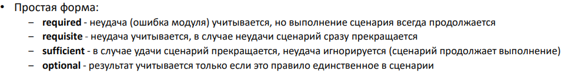
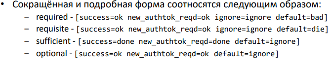

---

## ✅ Вывод

Блокировка логина пользователя `user` была реализована через PAM-модуль `pam_listfile.so`, ссылающийся на файл `/root/bannedusers`.  
Удаление записи `user` из этого файла восстановило возможность входа в систему.

---

## 🔹 Задание 5. Настройка парольной политики с использованием `pam_pwquality.so`

---

## 🧪 Цель задания

Изменить настройки модуля PAM `pam_pwquality.so` таким образом, чтобы соблюдались следующие правила безопасности при установке паролей:
- Две попытки на изменение пароля.
- Минимум 12 символов.
- Не менее 2 символов верхнего регистра.
- Не менее 2 цифр.
- Не менее 3 специальных символов.
- Не более двух одинаковых символов подряд.
- Не более двух подряд идущих символов одного класса.
- Запрет на использование определённых слов.
- Запрет на использование паролей из словаря `rockyou.txt`.

---

## ⚙ Настройка `/etc/security/pwquality.conf`

Конфигурация была отредактирована через:
```
nano /etc/security/pwquality.conf
```


Настроенные параметры:

- Максимум 2 попытки на ввод пароля:
  ```
  retry = 2
  ```
  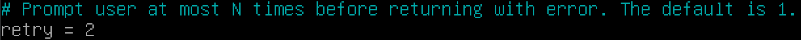

- Минимальная длина:
  ```
  minlen = 12
  ```
  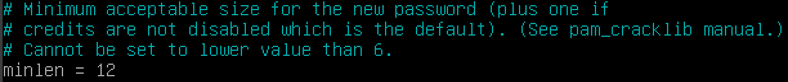

- Верхний регистр:
  ```
  ucredit = -2
  ```
  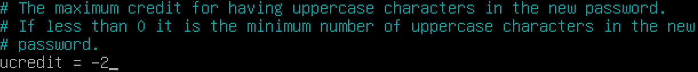

- Цифры:
  ```
  dcredit = -2
  ```
  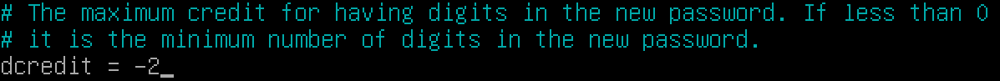

- Спецсимволы:
  ```
  ocredit = -3
  ```
  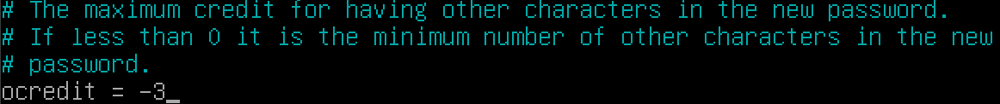

- Повторы символов:
  ```
  maxrepeat = 2
  maxclassrepeat = 2
  ```
  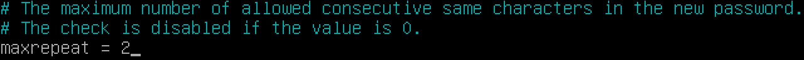
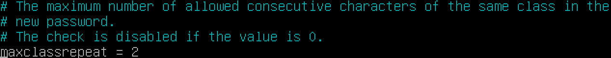

- Запрещённые подстроки:
  ```
  badwords = pass password p@ss p@$$ p@ssw0rd p@$$w0rd user root admin sudo lab laba
  ```
  

- Подключение словаря `rockyou.txt` осуществляется через аргумент `dictpath` в той же конфигурации либо через параметры модуля PAM (если прописан напрямую).

---

## ✅ Проверка

Пробная смена пароля, не соответствующего требованиям, завершалась ошибкой:  


После соблюдения всех условий пароль был успешно принят.

---

## 🧾 Вывод

Парольная политика была успешно ужесточена в соответствии с заданием.  
Проверка подтвердила корректную работу всех ограничений: длина, сложность, запрещённые слова, количество попыток.
